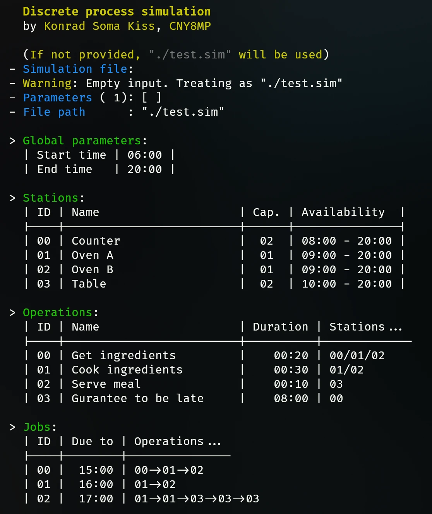
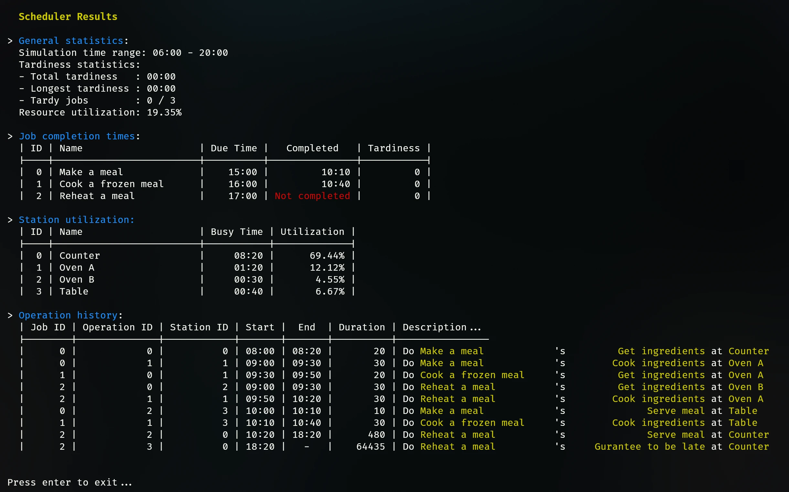

# ⚙️ Diszkrét folyamat szimulátor

    [](https://github.com/KissKonradUni/folyamatok_modellezese_beadando/releases)

> Készítette: 👨‍💻 Kiss Konrád Soma (CNY8MP)

## 🎯 Feladat

> Forrás: [Link](https://mandarin.iit.uni-miskolc.hu/iitkgy/do/FM_2025/Feladat/FM_feladat_2025.pdf)

Célszerűen választott fejlesztői környezetben készítsen számítógépi programot egy tetszőlegesen választott diszkrét folyamat hatékony szimulációjának megvalósítására.

Értékelési szintek és a kapcsolódó elvárások:

- Elégséges: A rendszerben megjelenő minden egyes munkához egynél több elvégzendő művelet (operáció) tartozik. Minden egyes művelet elvégzéséhez dedikált erőforrás áll rendelkezésre. A műveletek végrehajtási sorrendje munkánként egyedileg meghatározott.
- Közepes: Az előzőn túl további megvalósítandó funkció: A szimulált rendszerben korlátozott kapacitású tárolók/várótermek helyezkednek el.
- Jó: Az előzőn túl további megvalósítandó funkció: A műveleteket végrehajtó erőforrások (személyek/munkahelyek) nem folyamatosan állnak rendelkezésre, hanem előre meghatározott időintervallumokban dolgozhatnak.
- Jeles: Az előzőn túl további megvalósítandó funkció: Dolgozzon ki többcélú ütemezési/irányítási módszert, amely alkalmas a szimulált rendszer hatékony irányítására a következő optimalizálási célok szerint:
  - az utolsó munka befejezési időpontja legyen minimális.
  - a legnagyobb csúszás (határidő-túllépés) legyen minimális.
  - a csúszások összege legyen minimális.
  - a határidőt túllépő munkák száma legyen minimális.

A feladat megoldásához felhasználhatók a tantárgy előadásain és gyakorlatain bemutatott modellek, megoldási módszerek és algoritmusok. Mintapéldákon keresztül mutassa be az implementált szoftver működését!

## 💻 Megvalósítás

A projekt jelenleg egy First Come First Served (FCFS) ütemezési algoritmust valósít meg, amely a legkorábban érkező munkát dolgozza fel először.
Jelenleg ez az egyetlen egy van kivitelezve.
Az eredményt a terminálban szöveges formában jeleníti meg.

### 🏛️ Architektúra

A program moduláris felépítésű, több komponensből áll:

- `simulation.c` - A szimulációs modell alapjait tartalmazza (munkák, műveletek, állomások)
- `scheduler.c` - Az ütemezési algoritmus(ok)at és a szimuláció logikáját valósítja meg
- `array.c`, `mystring.c`, `file.c` - Segédmodulok a dinamikus memóriakezeléshez és fájlműveletekhez

### 🛠️ A szimuláció működése

A program egy fájlból olvassa be a szimulációs paramétereket, amely tartalmazza a munkák, műveletek és állomások adatait. Ezek mind diszkrét értékekkel vannak megadva, minden időpont pedig percben (0-1440) van megadva.

A szimuláció diszkrét lépésekben (percenként) halad, és minden egyes lépésben ellenőrzi, hogy van-e új munka, amelyet el kell kezdeni, vagy van-e olyan munka, amely befejeződött. Az ütemezési algoritmus alapján a program kiválasztja a következő munkát, amelyet végrehajtani kell.

### 🖼️ Képernyőképek

Egy beolvasott fájl által kiírt adatok:


Az eredmény futás után:


### ✅ Elért eredmények

Jelenlegi formályában a program a "Jó" szintű feladatot célozza meg.

A projekt elvileg képes windows és linux rendszereken is futni, de a tesztelés többségét linux alatt végeztem.

## 📦 Klónozás

```bash
git clone https://github.com/KissKonradUni/folyamatok_modellezese_beadando.git
```

## 🔨 Fordítás

```bash
make
```

## 🚀 Futtatás

```bash
./bin/simulator[.exe]
# Példák:
# test.sim - Egyszerű példa amely helyesen lefut
# late.sim - Garantáltan elkéső példa ami zárás előtt nem készül el
```

## 📜 Licensz

A projekt az [MIT Licensz](./license.txt) alatt érhető el.
